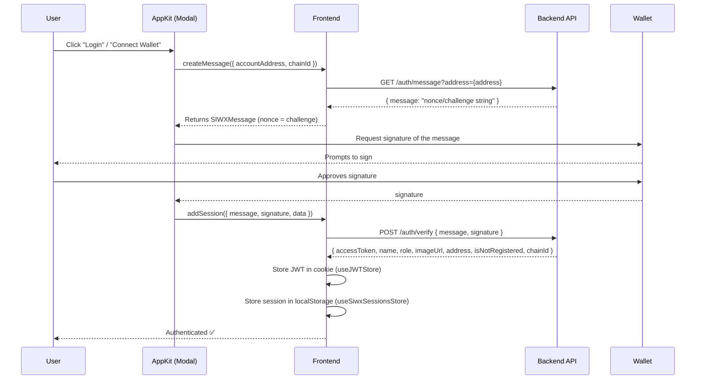

# Authentication Flow

Pawfund uses **wallet-based authentication** — there are no passwords. Users prove ownership of their Ethereum wallet by signing a message (SIWE/SIWX pattern), which the backend verifies to issue a JWT.

---

## Libraries

| Library | Role |
|---|---|
| `@reown/appkit` | Wallet connection modal, SIWE/SIWX orchestration |
| `@reown/appkit-siwe` | SIWE (Sign-In with Ethereum) config type |
| `@reown/appkit-siwx` | SIWX (Sign-In with X) session lifecycle callbacks |
| `wagmi` | `useAccount`, `useAppKitAccount` hooks |

> **Note:** Both `siwe-config.ts` and `siwx-config.ts` exist. The **active config** passed to `createAppKit` in `reown.provider.tsx` is `siweConfig`.

---

## High-Level Flow



---

## Key Files

| File | Purpose |
|---|---|
| [`src/lib/siwx-config.ts`](../src/lib/siwx-config.ts) | SIWX session lifecycle: createMessage, addSession, setSessions, getSessions, revokeSession |
| [`src/lib/siwe-config.ts`](../src/lib/siwe-config.ts) | SIWE config (currently the active one passed to AppKit) |
| [`src/lib/wagmi-adapter.ts`](../src/lib/wagmi-adapter.ts) | Wagmi + AppKit initialization (networks, projectId) |
| [`src/components/provider/reown.provider.tsx`](../src/components/provider/reown.provider.tsx) | `createAppKit`, `WagmiProvider`, disconnect handler |
| [`src/stores/jwt.store.ts`](../src/stores/jwt.store.ts) | JWT stored in a session cookie |
| [`src/stores/siwx-sessions.store.ts`](../src/stores/siwx-sessions.store.ts) | SIWX session objects in localStorage |
| [`src/features/auth/api/`](../src/features/auth/api/) | `auth-me.ts`, `message.ts`, `verify-signature.ts` |

---

## API Endpoints

### `GET /auth/message`

Retrieves a challenge/nonce for the user to sign.

**Query params:** `address` (wallet address)

**Response:**
```ts
{ message: string }  // The nonce/challenge string for signing
```

---

### `POST /auth/verify`

Verifies the signed message and issues a JWT.

**Request body:**
```ts
{
  signature: string  // Hex signature from wallet
  message: string    // The nonce string that was signed
}
```

**Response:**
```ts
{
  accessToken: string
  name: string | null
  role: 'FUNDRAISER' | 'SUPPORTER' | null
  imageUrl: string | null
  address: string
  isNotRegistered: boolean
  chainId: number
}
```

> `isNotRegistered: true` means this is a first-time wallet connection. The user has not yet selected a role. Redirect them to the registration/onboarding flow.

---

### `GET /auth/me`

Validates a JWT and returns current user data.

**Headers:** `Authorization: Bearer {token}`

**Response:** `AuthMeData`
```ts
type AuthMeData = {
  name: string | null
  role: 'FUNDRAISER' | 'SUPPORTER' | null
  imageUrl: string | null
  address: string
  isNotRegistered: boolean
  chainId: number
}
```

---

## JWT Storage (`useJWTStore`)

- **Location:** [`src/stores/jwt.store.ts`](../src/stores/jwt.store.ts)
- **Backed by:** Custom cookie storage (not localStorage/sessionStorage)
- **Cookie name:** `@pawfund/jwt`
- **Cookie attributes:** `Path=/`, `SameSite=Lax`, `Max-Age=Session` (expires on browser close)
- **Why cookie?** Cookies are readable server-side (Next.js Server Components and Route Handlers can access them via `next/headers`), enabling SSR-authenticated API calls

```ts
// Reading the token (client-side)
const token = useJWTStore(state => state.token)

// Setting the token
useJWTStore.getState().setToken(accessToken)

// Clearing the token (on logout/disconnect)
useJWTStore.getState().clearToken()
```

---

## Session Storage (`useSiwxSessionsStore`)

- **Location:** [`src/stores/siwx-sessions.store.ts`](../src/stores/siwx-sessions.store.ts)
- **Backed by:** `localStorage` under key `@pawfund/sessions`
- **Shape:** `SIWXSessionsExtended` = `SIWXSession & { jwt: string, user?: AuthMeData }`
- **Primary use:** Internal session lifecycle managed by `siwxConfig` callbacks — not typically accessed directly by UI code

```ts
// Get sessions for a specific wallet
useSiwxSessionsStore.getState().getSessions(chainId, address)

// Revoke a session
useSiwxSessionsStore.getState().revokeSession(chainId, address)
```

---

## Disconnect Handling

The `ReownDisconnectHandler` component (inside `reown.provider.tsx`) watches `useAppKitAccount().status`. When it becomes `"disconnected"` and a JWT exists, it calls `clearToken()` to log the user out client-side.

`siwxConfig.signOutOnDisconnect: true` also tells AppKit to clear its own session on disconnect.

---

## Session Validation on Load

When AppKit calls `getSessions` (e.g., on page load to restore a session), `siwxConfig.getSessions` is invoked. It:

1. Reads stored sessions from `useSiwxSessionsStore`
2. For each session, calls `GET /auth/me` with the stored JWT
3. If `/auth/me` succeeds → session is valid, JWT is refreshed in `useJWTStore`
4. If `/auth/me` fails → session is dropped (treated as expired/invalid)

---

## AppKit Initialization

AppKit is initialized **once at module load** in `reown.provider.tsx` via `createAppKit(...)`. Key config:

```ts
createAppKit({
  adapters: [wagmiAdapter],        // Wagmi integration
  projectId,                       // From env.NEXT_PUBLIC_REOWN_PROJECT_ID
  networks: [baseSepolia],         // Only Base Sepolia for MVP
  defaultNetwork: baseSepolia,
  features: {
    analytics: true,
    reownAuthentication: false,    // Disable Reown's native auth — use SIWE instead
    socials: ['google', 'github', 'apple', 'x', 'discord', 'farcaster'],
  },
  siweConfig: siweConfig,          // SIWE config (active)
  tokens: {
    'eip155:84532': {              // Base Sepolia USDC contract
      address: '0x036CbD53842c5426634e7929541eC2318f3dCF7e',
    },
  },
})
```

---

## Onboarding Flow (Planned)

When a user authenticates for the first time, `isNotRegistered: true` is returned from `/auth/verify`. The frontend should:

1. Detect `isNotRegistered === true` after successful sign-in
2. Redirect to a registration/onboarding page
3. User selects their role: **FUNDRAISER** or **SUPPORTER**
4. (Optionally) sets name and profile image
5. On completion, `role` will be set on subsequent `/auth/me` calls
