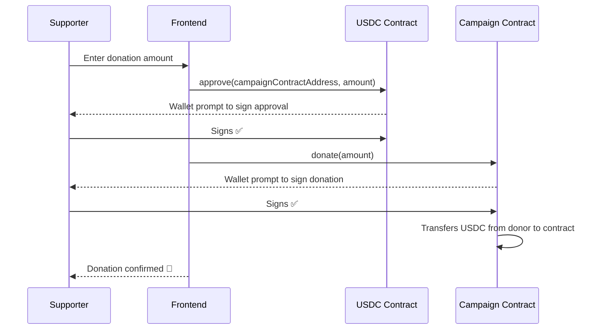

# Web3 Stack

## Overview

Pawfund interacts with the EVM (Ethereum Virtual Machine) using a layered stack:

```
AppKit (UI modal, SIWE/SIWX, wallet discovery)
    └── Wagmi (React hooks: accounts, contracts, transactions)
            └── Viem (low-level EVM: encoding, decoding, contract calls)
```

---

## Blockchain & Network

| Property | Value |
|---|---|
| Target network (MVP) | Base Sepolia (testnet) |
| Chain ID | 84532 |
| CAIP-2 | `eip155:84532` |
| Future | Base mainnet |

Network is configured in [`src/lib/wagmi-adapter.ts`](../src/lib/wagmi-adapter.ts):

```ts
import { baseSepolia } from '@reown/appkit/networks'

export const networks = [baseSepolia]  // First element = default network
```

> **MVP:** Only Base Sepolia is enabled. To add Base mainnet later, import `base` from `@reown/appkit/networks` and add it to the array.

---

## Libraries

### Reown AppKit (`@reown/appkit`)

The wallet connection layer. Provides:
- A pre-built wallet modal (supports MetaMask, Coinbase Wallet, WalletConnect, Smart Wallet, etc.)
- SIWE / SIWX sign-in orchestration
- Network switching UI
- Token balance display in modal

**Config location:** [`src/components/provider/reown.provider.tsx`](../src/components/provider/reown.provider.tsx)

Key hooks from `@reown/appkit/react`:
```ts
import { useAppKit, useAppKitAccount } from '@reown/appkit/react'

const { open } = useAppKit()           // Open the wallet modal
const { status, address } = useAppKitAccount()  // 'connected' | 'disconnected' | 'connecting'
```

**Reown Project ID:** `env.NEXT_PUBLIC_REOWN_PROJECT_ID` — get one at [dashboard.reown.com](https://dashboard.reown.com)

---

### Wagmi (`wagmi`)

React hooks for EVM interactions. Wraps Viem with React Query integration.

**Config:** `wagmiConfig` from [`src/lib/wagmi-adapter.ts`](../src/lib/wagmi-adapter.ts) — a `WagmiAdapter` from `@reown/appkit-adapter-wagmi`.

**SSR support:** Uses `cookieStorage` + `createStorage` so wallet state survives SSR (initial state hydrated from cookies via `cookieToInitialState`).

Commonly used hooks:
```ts
import { useAccount, useReadContract, useWriteContract, useReadContracts } from 'wagmi'

const { address, isConnected, chainId } = useAccount()
```

---

### Viem (`viem`)

Low-level EVM utilities. Used for:
- ABI types (`erc20Abi`)
- Unit conversion (`parseUnits`, `formatUnits`)
- Address types (`0x${string}`)

```ts
import { erc20Abi, parseUnits, formatUnits } from 'viem'
```

---

## USDC Token

| Property | Value |
|---|---|
| Token | USDC (USD Coin) |
| Standard | ERC-20 |
| Decimals | **6** (important: not 18) |
| Base Sepolia address | `0x036CbD53842c5426634e7929541eC2318f3dCF7e` |

> **Critical:** USDC uses 6 decimals. Always use `parseUnits(amount.toString(), 6)` when encoding amounts for contract calls.

The USDC contract address is hardcoded in two places currently:
- `src/components/provider/reown.provider.tsx` (AppKit `tokens` config)
- `src/components/login-button.tsx` (USDC balance display)

When building donation/withdrawal features, this address should be moved to a constant (e.g., `src/constants/tokens.ts`).

---

## Reading ERC-20 Balances

Custom hook: [`src/hooks/erc20-token-balance.ts`](../src/hooks/erc20-token-balance.ts)

Uses `useReadContracts` to batch-read `balanceOf`, `decimals`, and `symbol` in a single multicall:

```ts
import { useErc20TokenBalance } from '@/hooks/erc20-token-balance'

const { data, isLoading } = useErc20TokenBalance({
  tokenAddress: '0x036CbD53842c5426634e7929541eC2318f3dCF7e', // USDC Base Sepolia
  balanceOf: address,  // The wallet address to check
})

// data.balance     — raw bigint
// data.decimals    — token decimals (6 for USDC)
// data.symbol      — 'USDC'
// data.formatedBalance — human-readable string (e.g. "1,234.56")
```

---

## Smart Contract Architecture

Each campaign is represented by its **own deployed smart contract**. The backend tracks the `contractAddress` for each campaign.

The `CampaignDetail` type includes:
```ts
type CampaignDetail = {
  contractAddress: string  // The campaign's smart contract address
  // ...other fields
}
```

All on-chain interactions (donations, withdrawals) target `contractAddress` as the contract.

---

## Smart Contract Interaction Patterns

### Pattern: Read from a contract

Use `useReadContract` (single call) or `useReadContracts` (multicall batch):

```ts
import { useReadContract } from 'wagmi'

const { data } = useReadContract({
  address: campaignContractAddress,
  abi: campaignAbi,
  functionName: 'getRaisedAmount',
})
```

### Pattern: Write to a contract (transaction)

Use `useSimulateContract` + `useWriteContract` (recommended — simulates first to catch errors):

```ts
import { useSimulateContract, useWriteContract } from 'wagmi'
import { parseUnits } from 'viem'

// Step 1: Simulate to check for errors and get request
const { data: simulateData } = useSimulateContract({
  address: campaignContractAddress,
  abi: campaignAbi,
  functionName: 'donate',
  args: [parseUnits('10', 6)],  // 10 USDC (6 decimals)
})

// Step 2: Execute the transaction
const { writeContract, isPending, isSuccess } = useWriteContract()

writeContract(simulateData!.request)
```

---

## Donation Flow (Planned — not yet built)

Donating USDC to a campaign requires **two sequential transactions**:



**Step 1 — Approve:**
```ts
// Allow the campaign contract to spend the donor's USDC
writeContract({
  address: USDC_ADDRESS,
  abi: erc20Abi,
  functionName: 'approve',
  args: [campaignContractAddress, parseUnits(donationAmount.toString(), 6)],
})
```

**Step 2 — Donate:**
```ts
// After approval is confirmed, call donate on the campaign contract
writeContract({
  address: campaignContractAddress,
  abi: campaignAbi,
  functionName: 'donate',
  args: [parseUnits(donationAmount.toString(), 6)],
})
```

> Use `useWaitForTransactionReceipt` to wait for each transaction to be mined before proceeding to the next step.

---

## Fund Withdrawal Flow (Planned — FUNDRAISER only)

Only the campaign creator (fundraiser) can call `withdraw()`. The smart contract enforces this.

```ts
writeContract({
  address: campaignContractAddress,
  abi: campaignAbi,
  functionName: 'withdraw',
})
```

This transfers all collected USDC from the campaign contract to the fundraiser's wallet.

---

## Wallet Support

AppKit is configured to support:
- **Injected wallets:** MetaMask, Coinbase Wallet, any EIP-1193 provider
- **WalletConnect:** All WalletConnect-compatible mobile/desktop wallets
- **Smart Wallet:** Coinbase Smart Wallet (ERC-4337 account abstraction)
- **Social login (via Reown):** Google, GitHub, Apple, X, Discord, Farcaster

`reownAuthentication: false` disables Reown's native authentication — SIWE handles auth instead.
